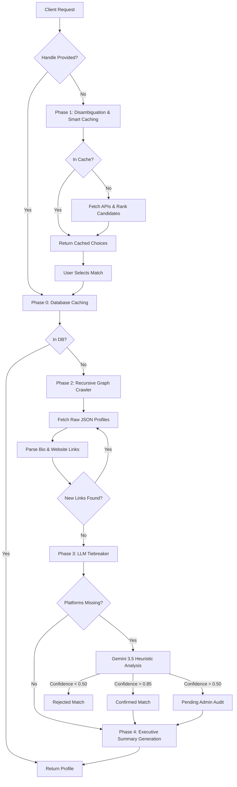

# Effiflo Dev Profile Unifier 🚀


A high-performance, fault-tolerant Master Data Management (MDM) system designed to ingest, resolve, and unify a software developer's digital footprint across fragmented platforms (GitHub, StackOverflow, Dev.to, and HackerNews).

Built to solve the hardest challenge in data engineering: **Identity Resolution**. If a database contains a GitHub account named "Nitesh Jha" and a Dev.to account named "Nitesh Jha", how does the system know with 100% certainty that they are the same human? This system solves it using a **Deterministic-to-Heuristic Resolution Pipeline**.

---

## 📑 Table of Contents
1. [Key Features & Engineering Decisions](#-key-features--engineering-decisions)
2. [End-to-End Architecture](#-end-to-end-architecture)
3. [The 5-Phase Resolution Engine](#-the-5-phase-resolution-engine)
4. [Storage Schema](#-storage-schema)
5. [Local Development Setup](#-local-development-setup)

---

## 🌟 Key Features & Engineering Decisions

- **Human-in-the-Loop (HITL) Admin Console:** The AI never makes destructive merges blindly. High-confidence LLM matches are auto-merged, while ambiguous edge cases are pushed to a visual Admin Audit console for manual verification.
- **Fault Tolerance & Async I/O:** Deep integration with Python's `asyncio` guarantees non-blocking execution. Strict 10-second timeouts prevent the event loop from freezing if external APIs (like HackerNews) go offline.
- **Rate Limit Protection:** Explicitly intercepts `HTTP 429` and StackOverflow "backoff" requests, instantly halting crawls and throwing `502 Bad Gateway` to the frontend rather than swallowing the error.
- **Distributed Observability:** Application-wide metrics (API calls, LLM token usage, resolution latency) are collected in-memory and asynchronously flushed to Supabase every 15 seconds, ensuring flawless tracking across multi-worker Uvicorn setups.

---

## 🏗 End-to-End Architecture



---

## 🧠 The 5-Phase Resolution Engine

### Phase 0: Database Caching
If the user provides an exact handle (e.g., `github="Niteshkrjhag"`), the engine bypasses all external network calls and checks the Supabase database. If the canonical profile was already resolved, it returns it instantly (< 50ms).

### Phase 1: Disambiguation & Smart Caching
If only a Name and Metadata are provided, the system must search the web to find potential matches.
- **Smart Hashing:** It hashes the exact inputs (e.g., `md5("nitesh|srinagar")`) and checks the `search_cache` table. If a previous user made the same search, it returns the choices instantly.
- **Candidate Ranking:** If not cached, it concurrently fetches search results from GitHub and StackOverflow. It parses the raw bio JSON of every candidate and increments a `match_score` if the text contains the requested Location or Workplace. The candidates are saved to the cache and returned to the UI for human selection.

### Phase 2: Recursive Graph Crawler
Once a candidate handle is selected (or provided initially), the high-performance async crawler begins.
- It fetches the initial profile and scans its raw JSON (websites, bio links, blog URLs) using regex cross-pollination.
- If it discovers a link to another platform (e.g., finding a Dev.to URL on their GitHub), it recursively fetches that new profile. 
- This mathematically exhausts the developer's deterministically connected graph.

### Phase 3: LLM Tiebreaker (Heuristic Fallback)
For any platforms still missing after the deterministic graph crawl, a fallback heuristic search is performed. The raw JSON of the newly found profile is sent alongside the "Anchor" profile to Gemini (acting as an expert semantic judge).
- **`> 85% Confidence:`** Auto-Merges the identity into the canonical database.
- **`50% - 84% Confidence:`** Flags the link as `pending_review`, requiring a Human-in-the-Loop admin audit.
- **`< 50% Confidence:`** Rejects the profile.

### Phase 4: Executive Summary Generation
Finally, the unified JSON data across all confirmed platforms is passed back to Gemini to generate a single, highly readable executive summary of the developer's entire career and impact.

---

## 🗄 Storage Schema (Supabase)
1. **`raw_profiles`**: Untouched JSON dumps from platforms (Event Sourcing pattern).
2. **`canonical_entities`**: The resolved "Human" identity containing the LLM-generated summary.
3. **`entity_links`**: The relational junction table mapping multiple raw profiles to a single canonical entity, storing the confidence score and audit status.
4. **`search_cache`**: High-speed cache for Phase 1 queries.
5. **`observability_metrics`**: Distributed telemetry tracking for API rate limits, LLM token costs, and system latency.

---

## 🚀 Local Development Setup

### 1. Install Dependencies
```bash
pip install -r requirements.txt
cd frontend && npm install
```

### 2. Configure Environment Variables
Create a `.env` file in the root directory:
```ini
SUPABASE_URL=your_url
SUPABASE_KEY=your_service_role_key
GEMINI_API_KEY=your_gemini_key

# Optional but recommended to avoid aggressive rate limiting
GITHUB_TOKEN=optional_github_token
STACK_EXCHANGE_KEY=optional_so_key
DEVTO_API_KEY=optional_devto_key
```

### 3. Run the Stack
Start both the backend server and frontend client:
```bash
# Terminal 1: Run the FastAPI Backend
uvicorn src.api.main:app --reload --port 8080

# Terminal 2: Run the React Vite Frontend
cd frontend && npm run dev
```
