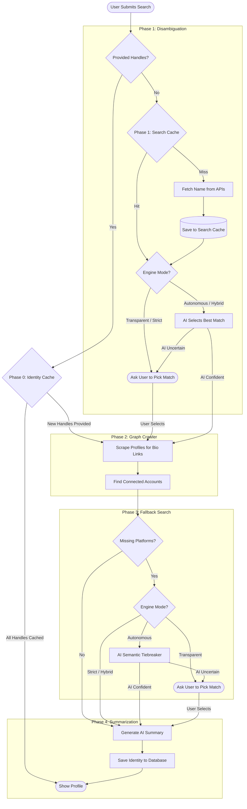

# Dev Profile Unifier

An intelligent Entity Resolution engine that aggregates a developer's fragmented footprint across GitHub, StackOverflow, Dev.to, and HackerNews into a single, unified canonical profile.

## Table of Contents
- [Architecture & Data Flow](#architecture--data-flow)
- [Schema Design](#schema-design)
- [Entity Resolution Strategy](#entity-resolution-strategy)
- [Observability](#observability)
- [Local Setup Instructions](#local-setup-instructions)
- [Next Week (Future Scope)](#next-week-future-scope)

---

## Architecture & Data Flow

The application is built with a **React** frontend and a **FastAPI** backend to ensure the user interface and the data processing engine can scale independently.

When a user searches for a developer, the engine processes the request in distinct phases:

1. **Phase 0 (Supabase Cache)**: Before making any external API calls, the engine checks our Supabase database. If *all* requested platform handles are already linked to a known profile, it returns the cached result instantly. If new handles are provided, it proceeds forward to fetch and link them.
2. **Phase 1 (Disambiguation)**: If we only have a common name (e.g., "Nitesh"), the engine queries the platforms for their top 5 closest matches to present as candidates.
3. **Phase 2 (Graph Crawler)**: The engine uses recursive graph traversal. It scans a developer's bio (like their GitHub profile) for external links (like a personal website or Twitter handle), and follows those links to discover their other accounts deterministically.
4. **Phase 3 (LLM Tiebreaker)**: If deterministic links are missing, the engine sends the raw profile data to an AI model (**Gemini 3.5 Flash**). The AI acts as a semantic resolution agent, analyzing coding languages and writing styles to determine if two accounts belong to the exact same human.
5. **Phase 4 (Summary Generation)**: Finally, the AI generates a concise, professional summary combining all the unified data.



## Schema Design

We use a **Star Schema** in Supabase to keep our data structured and safe:

- **`canonical_entities`**: The single source of truth representing a unique human being.
- **`raw_profiles`**: Immutable JSON snapshots of individual platform accounts (e.g., a specific GitHub account).
- **`entity_links`**: A junction table that bridges a `raw_profile` to a `canonical_entity`. 
- **`search_cache`**: Caches the heavy cross-platform candidate searches to reduce API spam.
- **`api_metrics`**: A centralized table for logging API calls and tracking external rate limits in real-time.

If the AI is uncertain about a match, it flags the `entity_link` with a "Pending Review" status. This allows a human administrator to manually approve or reject the AI's decision without deleting the underlying raw data.

## Entity Resolution Strategy

Our strategy balances execution speed, API rate limits, and accuracy:

1. **Deterministic Matching (Fast)**: If a developer explicitly provides their handles, or if our Graph Crawler extracts a direct link from their bio, we link the accounts with 100% confidence. This avoids using AI entirely, saving processing time and API costs.
2. **N-Gram Heuristic Filter**: We use lightweight string matching on locations and company names to quickly discard obvious mismatches before they reach the AI.
3. **Semantic LLM Matching**: For complex disambiguation, we use Large Language Models (LLMs) to catch nuanced signals that traditional code might miss, like shared obscure repositories.

## Observability

Because AI tokens and external API calls are expensive and heavily rate-limited, we built a custom Observability Tracker. 

The **Health** tab in the UI exposes real-time metrics, allowing us to monitor exactly how many API calls we've made to GitHub and how many LLM tokens we've consumed during the resolution process.

---

## Local Setup Instructions

### Prerequisites
- Python 3.12.3
- Node.js 18+
- A Supabase Project 

### 1. Environment Variables
Copy `.env.example` to `.env` in the root directory and fill in your API keys:
```bash
cp .env.example .env
```

### 2. Backend Setup
```bash
python3 -m venv .venv
source .venv/bin/activate
pip install -r requirements.txt
uvicorn src.server:app --host 0.0.0.0 --port 8080 --reload
```

### 3. Frontend Setup
```bash
cd frontend
npm install
npm run dev
```

---

## What I Would Do With More Time (Next Week)

If I had another week, I would focus on **Extreme Latency Reduction**:

1. **Concurrent Graph Resolution**: Currently, if a search returns 30 GitHub candidates, the user must select one before we crawl for their other platform links. I would re-architect the engine to build connectivity graphs for *all* candidates concurrently, presenting fully unified clusters to the user instantly.
2. **GraphQL Migration**: We currently make up to 7 sequential REST API calls to fully resolve a single GitHub profile. I would migrate this to the GitHub GraphQL API, allowing us to fetch the profile, repositories, and recent events in a single network request, drastically reducing latency.
